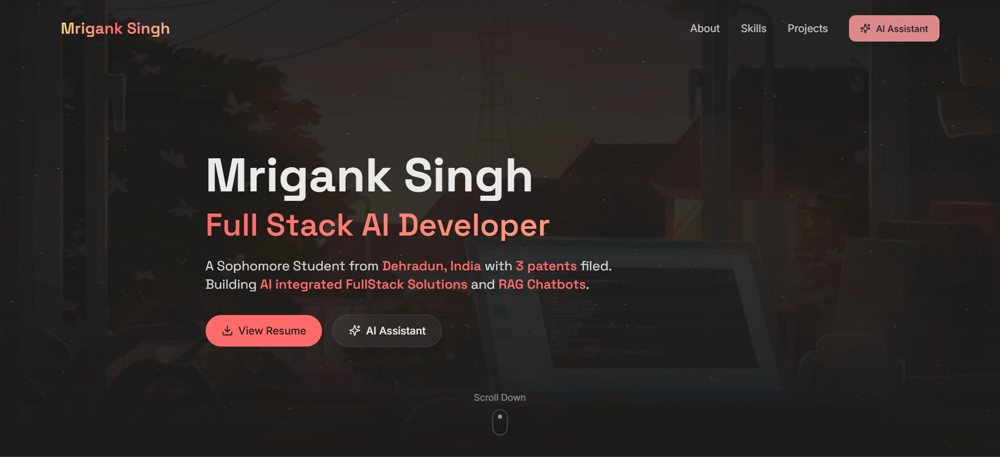

# 🚀 Mrigank Singh | AI-Integrated Portfolio

## 👋 Overview

Welcome to my personal portfolio! This isn't just a static showcase of my work—it's a **Full-Stack AI Application**. 

Beyond displaying my projects (DASES, MealMatch) and my 3 patents, this site features a **custom RAG (Retrieval-Augmented Generation) Chatbot**. "Mrigank AI" can answer questions about my technical skills, experience, and background in real-time, powered by a vector database and Google's Gemini LLM.

## ✨ Key Features

* **🤖 AI Assistant (RAG Chatbot):**
    * A persistent, context-aware chatbot trained on my resume and technical documentation.
    * **Tech:** Google Gemini 2.5 Flash Lite + Pinecone Vector DB.
    * **UX:** Features "typing effect" streaming, Markdown rendering, and session persistence.
    * **Architecture:** Desktop Sidebar / Mobile Bottom Drawer.
* **🎨 Modern UI/UX:**
    * Glassmorphism design language using **Tailwind CSS**.
    * Smooth animations powered by **Framer Motion**.
    * Fully responsive layout for all devices.
* **🛠️ Real-World Engineering:**
    * **Cold Start Handling:** Implemented "Health Pings" to wake up the serverless backend immediately on site load.
    * **Security:** CORS configured backend and clean environment variable management.

## 🛠️ Tech Stack

### Frontend (This Repo)
* **Framework:** React (Vite)
* **Styling:** Tailwind CSS, PostCSS
* **Animations:** Framer Motion
* **Icons:** Lucide React
* **Markdown:** `react-markdown` with `remark-gfm`
* **Deployment:** Vercel

### Backend ([Separate Service](https://github.com/Mrigank005/Portfolio-Backend))
* **API:** FastAPI (Python)
* **LLM:** Google Gemini 2.0 Flash Lite Preview
* **Vector DB:** Pinecone (768 Dimensions)
* **SDK:** Google GenAI SDK v1.0
* **Deployment:** Render

## 🧠 AI Architecture

The "Mrigank AI" chatbot works on a **Retrieval-Augmented Generation (RAG)** pipeline:

1.  **Ingestion:** My resume and project docs are chunked and embedded using `gemini-embedding-001`.
2.  **Storage:** Vectors are stored in a **Pinecone** index.
3.  **Query:** When you ask a question, the backend searches Pinecone for the most relevant context.
4.  **Generation:** The context + your question are sent to **Gemini 2.5 Flash**, which generates a grounded response.
5.  **Response:** The answer is sent back to the frontend and rendered with a typing animation.

## 📬 Contact

* **Mrigank Singh**
* **Email:** [mriganksingh005@gmail.com]
* **LinkedIn:** [https://www.linkedin.com/in/mrigank005]
* **GitHub:** [https://github.com/Mrigank005]

---

*© 2026 Mrigank Singh. Built with ❤️ and a lot of caffeine.*
